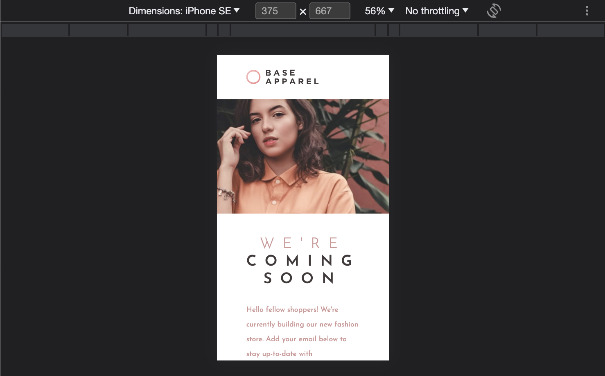

# Frontend Mentor - Base Apparel coming soon page solution

This is a solution to the [Base Apparel coming soon page challenge on Frontend Mentor](https://www.frontendmentor.io/challenges/base-apparel-coming-soon-page-5d46b47f8db8a7063f9331a0). Frontend Mentor challenges help you improve your coding skills by building realistic projects. 

## Table of contents
- [Overview](#overview)
  - [The challenge](#the-challenge)
  - [Screenshot](#screenshot)
  - [Links](#links)
- [My process](#my-process)
  - [Built with](#built-with)
  - [What I learned](#what-i-learned)
  - [Continued development](#continued-development)
  - [Useful resources](#useful-resources)
- [Author](#author)
- [Acknowledgments](#acknowledgments)

## Overview
### The challenge
Users should be able to:
- View the optimal layout for the site depending on their device's screen size
- See hover states for all interactive elements on the page
- Receive an error message when the `form` is submitted if:
  - The `input` field is empty
  - The email address is not formatted correctly

### Screenshot



### Links
- Live Site URL: 

## My process
### Built with
- Semantic HTML5 markup
- CSS custom properties
- Flexbox
- Bootstrap
- jQuery
- jQuery validation plugin


### What I learned
plugin.
第一次使用插件，雖然是網路上的大神們解救，
但還是想要多去暸解這些功能是怎麼運作的，
就像數學如果沒有寫過證明，只有死背公式的話，
那些東西就無法存在我的腦裡，隔天就會忘記的那種暫存，哈哈哈。

```js
function changeCSS() {
    $(".error-text").css("display", "block");
    $(".submit-content>img").css("display", "block");
    $(".submit-content:focus-within").css("border", "1.5px solid hsl(0, 93%, 68%)");
}

$(".submit-content").validate({
    invalidHandler: function () {
        changeCSS();
    },
    onfocusout: function () {
        changeCSS();
    }
});

jQuery.extend(jQuery.validator.messages, {
    required: "",
    email: "",
});
```

### Continued development
Another validation

### Useful resources
- [jQuery validation: change default error message](https://stackoverflow.com/questions/2457032/jquery-validation-change-default-error-message)
- [jQuery validation plugin](https://jqueryvalidation.org/validate/)

## Author
- Frontend Mentor - [@YAcodingroom]
(https://www.frontendmentor.io/profile/YAcodingroom)
- Threads - [@nt19_lya](https://www.threads.net/@nt19_lya)

## Acknowledgments
感謝Ivy&Ciao，感謝Angela老師，感謝靜文老師，感謝Google，感謝Bootstrap，感謝宇宙，感謝自己。